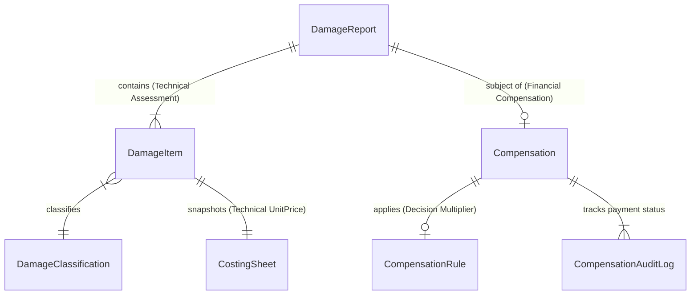
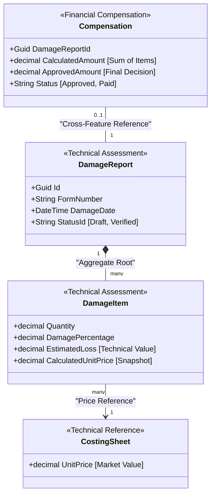

# Damage Report — Final Architecture Verification

Verification of the separation between **Technical Assessment** and **Financial Compensation** before Sprint 12.1 implementation.

## 1. Separation of Concerns

The architecture is designed to maintain a strict boundary between the technical findings in the field and the subsequent financial decisions.

### Technical Assessment (Immutable Foundation)
- **Entities**: `DamageReport`, `DamageItem`.
- **Logic**: Performed by Agricultural Engineers.
- **Focus**: Physical damage, quantities, and technical valuation.
- **CostingSheet Role**: Acts as the **Technical Valuation Reference**. It provides the standard market value for the asset (e.g., "The technical value of a mature olive tree is €100").
- **Snapshot Pattern**: `DamageItem` captures `CalculatedUnitPrice` and `EstimatedLoss` (Technical Value). Once a report is "Verified", these fields are immutable.

### Financial Compensation (Business Layer)
- **Entities**: `Compensation`, `CompensationRule`.
- **Logic**: Performed by Ministerial committees.
- **Focus**: Eligibility, funding limits, and payment.
- **CompensationRule Role**: Acts as the **Political/Financial Decision**. It defines how much of the technical value will be paid (e.g., "Compensate 60% of the technical value").
- **Independence**: The `Compensation` entity points to the `DamageReport` but does not reside within it. It calculates its `ApprovedAmount` based on the report's `EstimatedLoss` without modifying the report itself.

---

## 2. Updated ER Relationship

---

## 3. Domain Diagram (Target State)

---

## 4. Migration & Future-Proofing Confirmation

> [!IMPORTANT]
> **No Migration Required**: The current implementation of `DamageReport` and `DamageItem` is fully decoupled from the financial logic.
>
> When the Compensation module is introduced to the Flutter app in a future sprint:
> 1. A new `Compensations` table will be added to Drift.
> 2. A new `CompensationRepository` will be created.
> 3. **The `DamageReport` schema will remain untouched.**
>
> The `Compensation` entity will simply fetch the `DamageReport` (Technical Assessment) to read the `EstimatedLoss` and then store the `ApprovedAmount` in its own table.

---

## 5. Costing Sheet vs. Compensation Decision

- **CostingSheet**: **Technical Valuation Reference**. (e.g., Price per tree).
- **CompensationRule**: **Financial Decision**. (e.g., 60% payout).

The system architecture treats these as two distinct concepts in different domains (Technical vs. Financial).

**Sprint 12.1 implementation is ready to proceed.**
