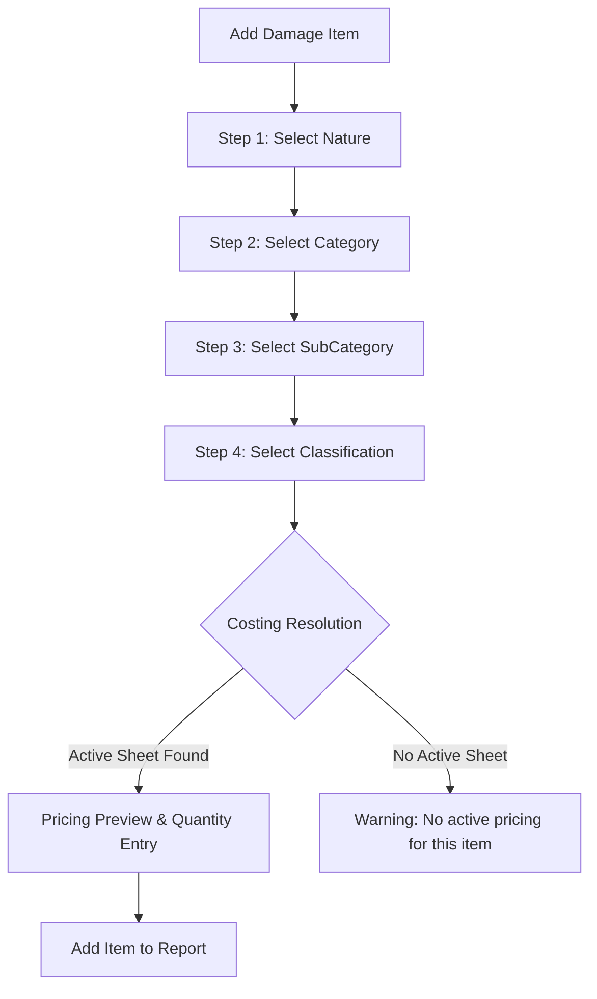

# Sprint 12.2: Final Hierarchical Classification UI Design

Final technical design and behavioral rules for the cascading classification selector.

## 1. Classification Wizard Levels

The wizard consists of **4 User Selection Steps**. The 5th level (Costing) is resolved automatically.

| Step | Level | Selection | Behavior |
| :--- | :--- | :--- | :--- |
| **1** | **Damage Nature** | Required | e.g., Plants, Livestock. |
| **2** | **Damage Category** | Required | e.g., Trees, Field Crops. |
| **3** | **Damage SubCategory** | Required | e.g., Fruit Trees, Olive Trees. |
| **4** | **Damage Classification**| Required | e.g., Olive Trees (Age 5-10). |
| **Final**| **Costing Sheet** | **Automatic** | System fetches the active version. |

## 2. User Selection Experience (Flow)

## 3. Search & Localization

- **Local First**: All queries are performed against the local Drift database.
- **RTL/Arabic Support**: Search filters apply to `nameAr` and `nameEn`.
- **Partial Matching**: Searching "زيت" will match "أشجار زيتون" via SQL `LIKE %text%`.
- **Performance**: Indices on `parentId` and `nameAr/nameEn` ensure sub-second response times for lists up to 1000 items.

## 4. Invalid Classification Handling

- **Rule**: A classification is invalid if it has no associated record in the `CostingSheets` table with `isActive = true`.
- **UI Behavior**:
    - The classification remains visible but marked with a "Price Unavailable" badge.
    - If selected, the "Next/Add" button is disabled.
    - A message "Pricing for this item has not been synchronized or is inactive" is shown.
- **Strict Integrity**: **Manual price entry is strictly prohibited** to ensure technical assessment standards.

## 5. State Management & Cascading Resets

Managed by `ClassificationWizardProvider` (Riverpod `StateNotifier`):

- **State Model**: Holds `selectedNature`, `selectedCategory`, `selectedSubCategory`, `selectedClassification`, and `resolvedCosting`.
- **Cascading Reset Logic**:
    - Changing **Nature** clears Category, SubCategory, Classification, and Costing.
    - Changing **Category** clears SubCategory, Classification, and Costing.
    - Changing **SubCategory** clears Classification and Costing.

## 6. Snapshot Integrity (Historical Audit)

Once "Add Item" is pressed, the following values are hard-copied into the `DamageItem` record:
- `classificationId`
- `costingSheetId` (The GUID of the specific version)
- `calculatedUnitPrice` (Snapshot of decimal value)
- `measurementUnitSnapshot` (Snapshot of string, e.g., "Tree")

## 7. Sprint 12.2 Scope Lock

### ✅ Allowed
- Hierarchical Bottom Sheet UI.
- Local Search/Filter logic.
- Costing Sheet resolution engine.
- Item "Drafting" state in the form.

### ❌ Not Allowed
- Workflow status transitions.
- Attachment uploads.
- Official Form Number assignment (Backend logic).
- Agricultural Assistance calculations.
