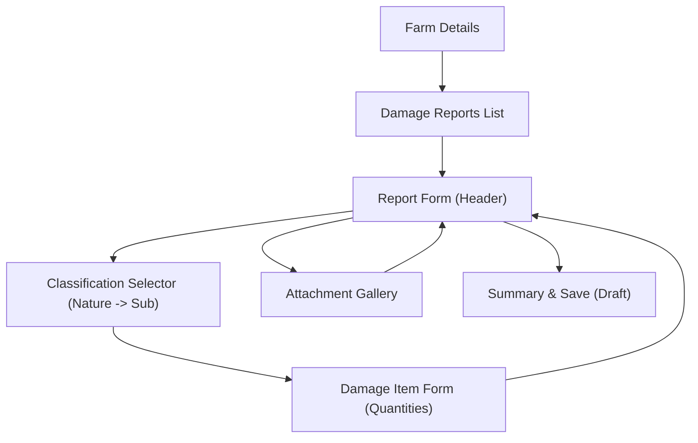

# Damage Report — Mobile Architecture Review (Sprint 12)

Detailed technical design for the Damage Report module in the HASAD mobile application.

## 1. Feature Structure

The module follows the **Feature-First** architecture, isolated from the `farmers` module to improve maintainability and follow Clean Architecture principles.

```text
lib/features/damage_reports/
    data/
        repositories/       # OfflineFirst implementations
        dto/                # Sync DTOs (e.g., DamageReportSyncDto)
    domain/
        models/             # Freezed immutable models
        repositories/       # Abstract interfaces
        validators/         # Business rule enforcement
    presentation/
        screens/            # Feature screens (List, Form, Details)
        widgets/            # Reusable local components (Item Cards, Selectors)
        providers/          # Riverpod state management
    sync/                   # Feature-specific sync logic (if any)
    routing/                # Feature-specific route definitions
```

### Folder Responsibilities:
- **`data/`**: Handles data persistence (Drift) and API communication (Dio). Repositories here implement the "Offline-First" logic.
- **`domain/`**: Contains the "Source of Truth" models. Pure business logic and validators live here, completely decoupled from any UI or storage technology.
- **`presentation/`**: Standardizes state management using Riverpod. Screens are reactive to Drift streams.
- **`sync/`**: Contains specialized mapping logic for the Background Sync Engine to transform local entities into server-ready commands.
- **`routing/`**: Defines the sub-navigation tree for the module.

---

## 2. Domain Models

| Model | Purpose | Identity (Local/Server) | Sync Behavior |
| :--- | :--- | :--- | :--- |
| **DamageReport** | Main container for assessment header. | Local: UUID / Server: GUID | Full Offline CRUD + Status Workflow. |
| **DamageItem** | Individual assessment line items. | Local: UUID / Server: GUID | Synced as part of the Report aggregate. |
| **DamageClassification**| 5th level of hierarchy (e.g., "Olive Trees").| Integer ID (Lookups) | Read-only (Reference Data). |
| **CostingSheet** | Versioned price snapshot for a classification.| UUID (Server-only) | Read-only (Reference Data). |
| **DamageCause** | Hierarchical cause of damage. | Integer ID (Lookups) | Read-only (Reference Data). |
| **Attachment** | Evidence photos/documents. | Local: UUID / Server: GUID | Sequential upload via Sync Queue. |

> [!IMPORTANT]
> **Snapshot Pattern**: `DamageItem` will store a `calculatedUnitPrice` and `costingSheetId` at the moment of creation. This ensures that even if prices change in the future, the historical value of the report is preserved.

---

## 3. Repository Responsibilities

### DamageReportRepository
- **Local CRUD**: Saves header, items, and metadata to Drift.
- **Remote Sync**: Generates `CreateDamageReportCommand` payloads for the sync engine.
- **Geographic Filtering**: Filters reports based on the user's assigned Directorate/Governorate.
- **Duplicate Prevention**: Rejects creation if a report exists for the same `FarmId` and `DamageDate`.

### ReferenceDataRepository (Shared)
- **Hierarchical Lookup**: Provides methods like `getClassificationsBySubCategory(id)`.
- **Price Resolution**: Returns the currently active `CostingSheet` for a given `ClassificationId`.

---

## 4. Provider Architecture

### Repository Providers
- `damageReportRepositoryProvider`: Provides `OfflineFirstDamageReportRepository`.

### Form Providers
- `damageReportFormProvider`: A `StateNotifierProvider` managing the `DamageReport` being created or edited.
- `damageItemFormProvider`: Temporary state for the item being added (handles the 5-step classification selection).

### Lookup Providers (Reactive)
- `damageHierarchyProvider(natureId?)`: Watches Drift tables for Nature -> Category -> Sub -> Classification.
- `damageCausesProvider(categoryId?)`: Watches hierarchical causes.
- `activeCostingSheetProvider(classId)`: Fetches the latest price for snapshotting.

---

## 5. Navigation Flow

Navigation follows the **Breadcrumb Pattern** established in the Farm module.



---

## 6. Form State Management
- **Persistence**: Every field change in the `DamageReportForm` is saved to the Drift `DamageReports` table with `statusId = 'Draft'`.
- **Restoration**: If the app crashes or the user navigates away, re-opening the form for that `FarmId` restores the Draft.
- **Validation**: Enforced at the Domain layer (`DamageReportValidator`). Items cannot be added without a valid price snapshot.

---

## 7. Lookup Loading Strategy
- **Source**: `ReferenceDataRepository.getReferenceData()` (Batch fetch).
- **Cache**: Persistent Drift tables (e.g., `DamageClassifications`).
- **Refresh**: Triggers automatically on login and can be forced via "Sync Master Data" in settings.
- **Offline**: Entirely offline-available after the initial sync.

---

## 8. Sync Strategy

1. **Create**: Record is saved as `pending`. Sync engine sends `CreateDamageReportCommand` with `clientId`.
2. **Update**: Server returns `200 OK` + `serverId`. Local record is updated with server ID.
3. **Late Binding**: If the `FarmId` is still a local UUID, the sync engine resolves it using the `serverId` of the Farm record before sending.
4. **Numbering**: Mobile uses `temporaryFormNumber`. Server replaces it with the official `FormNumber` upon successful sync.

---

## 9. Performance Review
- **Lookups**: ~500 hierarchy nodes loaded into memory via `ReferenceData` provider (optimized with `select` queries).
- **Streams**: List screens use `watch()` to ensure real-time updates when background sync completes.
- **Memory**: Images are handled as File paths; only thumbnails are loaded in the gallery to minimize heap usage.

---

## 10. Sprint Breakdown

### Sprint 12.1 — Data Layer & Feature Extraction
- **Scope**: Extract `damage_reports` feature, update Drift schema v12, implement repository.
- **Complexity**: Medium.
- **Risk**: Low.

### Sprint 12.2 — Hierarchical Classification UI
- **Scope**: Implement the 5-level cascading selectors and Price snapshot engine.
- **Complexity**: High.
- **Risk**: UI complexity and state management of deep hierarchies.

### Sprint 12.3 — Form & Sync Hardening
- **Scope**: Implement Report Form, Sync DTOs, and Background Sync integration.
- **Complexity**: Medium.
- **Risk**: Conflict resolution edge cases.

### Sprint 12.4 — Verification & QA
- **Scope**: Automated tests, manual QA, and Documentation updates.
- **Complexity**: Low.
