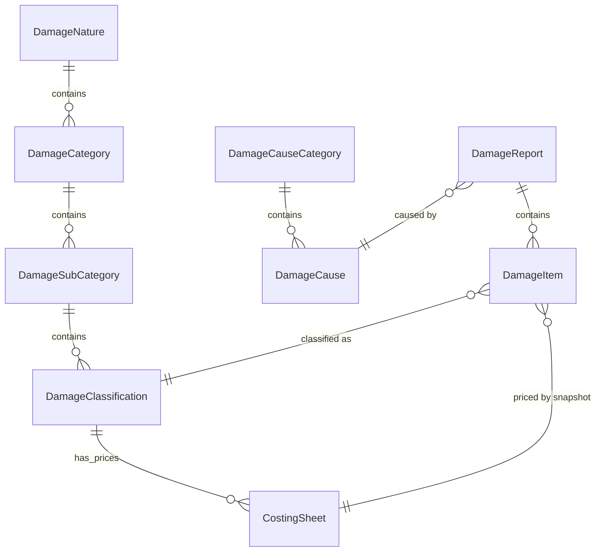

# Sprint 12.1: Damage Classification & Costing Foundation

## Entity Relationship Diagram (ERD)

### Detailed Fields

#### Damage Classification Hierarchy
- **DamageNature**: `Id`, `NameAr`, `NameEn`
- **DamageCategory**: `Id`, `NatureId`, `NameAr`, `NameEn`
- **DamageSubCategory**: `Id`, `CategoryId`, `NameAr`, `NameEn`
- **DamageClassification**: `Id`, `SubCategoryId`, `NameAr`, `NameEn`
- **CostingSheet**: `Id`, `ClassificationId`, `UnitPrice`, `EffectiveFrom`, `EffectiveTo`, `IsActive`, `VersionNumber`

#### Damage Cause Hierarchy
- **DamageCauseCategory**: `Id`, `NameAr`, `NameEn` (e.g., Political, Natural)
- **DamageCause**: `Id`, `CategoryId`, `NameAr`, `NameEn`

---

## Migration Impact Analysis

### Affected Tables
- **DamageReports**:
    - `[NEW]` `FormNumber` (Unique Index)
    - `[NEW]` `TemporaryFormNumber`
    - `[NEW]` `DamageYear`
    - `[NEW]` `DamageCauseId` (FK to `DamageCause`)
    - `[NEW]` `DamageTypeId` (FK to `DamageCauseCategory`)
- **DamageItems**:
    - `[NEW]` `ClassificationId` (FK to `DamageClassification`)
    - `[NEW]` `CostingSheetId` (Snapshot FK)
    - `[NEW]` `CalculatedUnitPrice` (Snapshot)
    - `[NEW]` `MeasurementUnitSnapshot` (String)

### Safety & Compatibility
- **Data Loss**: No production data currently exists. Existing placeholder data in dev environments will be migrated with default values or cleared.
- **Constraints**: Foreign keys will be enforced with `DeleteBehavior.Restrict` to ensure hierarchy integrity.
- **Indexes**: Unique index on `DamageReports(FarmId, DamageDate)` will be added.

---

## Seed Data Strategy

1.  **Damage Nature**: Plant, Animal, Infrastructure.
2.  **Damage Category (Plant)**: Trees, Field Crops, Protected Crops.
3.  **Damage SubCategory (Trees)**: Olive, Stone Fruits, Citrus.
4.  **Damage Classification (Olive)**: Age 1-5 years, Age 5-10 years, Age 10+ years.
5.  **Costing Sheet**: Initial prices for all classifications (e.g., Olive 5-10y = 100 EUR).
6.  **Damage Causes**:
    - Category: **Political** -> Causes: Army, Settlers, Israeli Companies.
    - Category: **Natural** -> Causes: Flood, Fire, Drought, Storm.

---

## Implementation Tasks

### Backend
- [ ] Create domain entities and configurations.
- [ ] Implement `GetReferenceDataQuery` updates to include new hierarchies.
- [ ] Add EF Core migration `DamageClassificationFoundation`.
- [ ] Implement seed data in `DbInitializer`.
- [ ] Unit tests for hierarchy validation and price retrieval.

### Flutter
- [ ] Add Drift tables for all new lookups.
- [ ] Update `DamageReportLocal` and `DamageItemLocal` tables.
- [ ] Implement `OfflineFirstReferenceDataRepository` updates.
- [ ] Widget tests for offline lookup availability.
