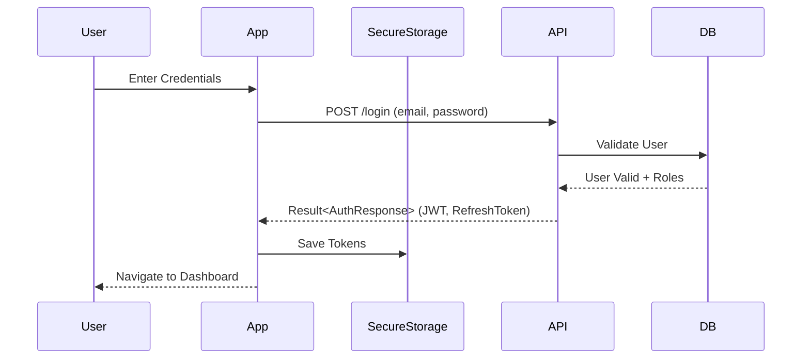
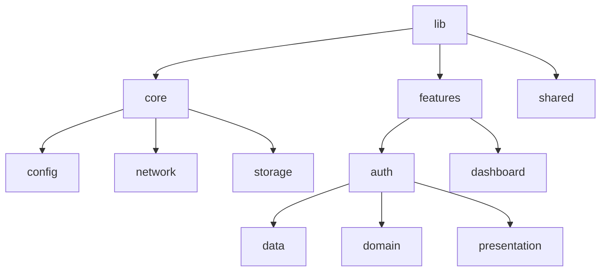
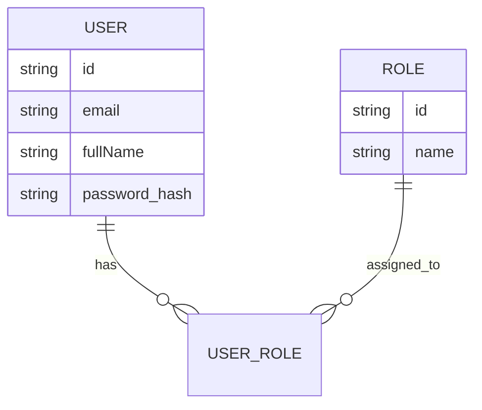

# System Diagrams

## Authentication Flow

```mermaid
sequenceDiagram
    participant User
    participant App
    participant SecureStorage
    participant API
    participant DB

    User->>App: Enter Credentials
    App->>API: POST /login (email, password)
    API->>DB: Validate User
    DB-->>API: User Valid + Roles
    API-->>App: Result<AuthResponse> (JWT, RefreshToken)
    App->>SecureStorage: Save Tokens
    App-->>User: Navigate to Dashboard
```

## Folder Structure (Mobile)

```mermaid
graph TD
    lib --> core
    lib --> features
    lib --> shared
    core --> config
    core --> network
    core --> storage
    features --> auth
    features --> dashboard
    auth --> data
    auth --> domain
    auth --> presentation
```

## Entity Relationship (Auth)

```mermaid
erDiagram
    USER ||--o{ USER_ROLE : has
    ROLE ||--o{ USER_ROLE : assigned_to
    USER {
        string id
        string email
        string fullName
        string password_hash
    }
    ROLE {
        string id
        string name
    }
```
